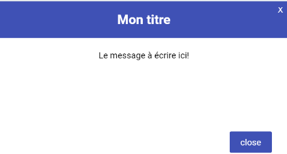

# Getting Started

  

Ce package vous permet de créer une modale d'une manière simple. Vous pouvez la personnaliser en ajoutant de l'animation et vos propres couleurs.
## Les 3 types de modal




## Utilisation du composant Modal

```javascript
//Importer le composant Modal
import Modal from "react-personalizable-modal-by-fatma/src/Modal"

//Dans la partie déclaration
const [isOpen,setIsOpen]=useState(false);

//Dans la partie return
<Modal  isOpen = {isOpen}  setIsOpen={setIsOpen}
type="ERROR"
icone={true}
titre="Sauvegarde Employee"
texte="Employé ajouté avec succès!"
animation = {true}  animationFrom={"LEFT"}
/>

//Au clic sur le bouton 
<button onClick={()=>{setIsOpen(true);}}>Ouvrir modal</button>
```
## Les props du composant Modal
| Propriété | Valeur  | Description | 
|-- |--|--|
|type|ERROR/SUCCESS|Sin on ne met rien , la modale aura une couleur par défaut et il n'y aura pas d'icone|
|isAnimated |true/false  |
|animationFrom |TOP, BOTTOM, RIGHT,LEFT|La valeur par défaut est TOP|
| title |string  |
| text |string  |


