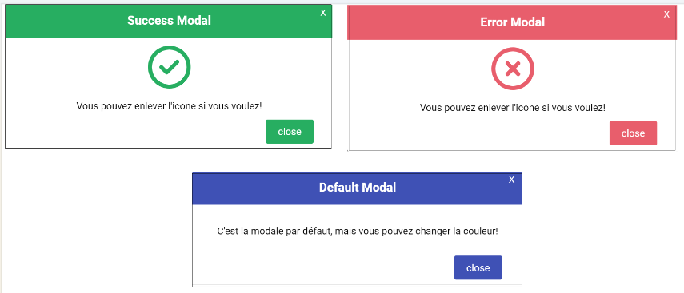

# Getting Started

Ce package vous permet de créer une modale d'une manière simple. Vous pouvez la personnaliser en ajoutant de l'animation et vos propres couleurs.

## Les 3 types de modal




## Utilisation du composant Modal  

```javascript

//Importer le composant Modal
import  Modal  from  "react-personalizable-modal-by-fatma/src/Modal"

//Dans la partie déclaration
const [isOpen,setIsOpen]=useState(false);
  
//Dans la partie return
<Modal  isOpen = {isOpen}  setIsOpen={setIsOpen}
type="ERROR"
icone={true}
titre="Titre"
texte="Texte souhaité!"
animation = {true}  animationFrom={"LEFT"}
/>

//Au clic sur le bouton
<button  onClick={()=>{setIsOpen(true);}}>Ouvrir modal</button>
```

## Les props du composant Modal

| Propriété | Valeur  | Description | 
|-- |--|--|
|type|ERROR/SUCCESS|Sin on ne met rien , la modale aura une couleur par défaut et l'icone sera affichée|
|isAnimated |true/false  |
|animationFrom |TOP, BOTTOM, RIGHT,LEFT|La valeur par défaut est TOP|
|bgColor|blue/red/#000…|Permet de changer la couleur du background du header et du bouton.|
|containerStyle|**exemple** : containerStyle={{width:  '400px',height :'100px'}}|
|textStyle|**exemple** : textStyle={{fontSize:  '20px',text-align:'center'}}|
| title |string  | |
| text |string  | |
